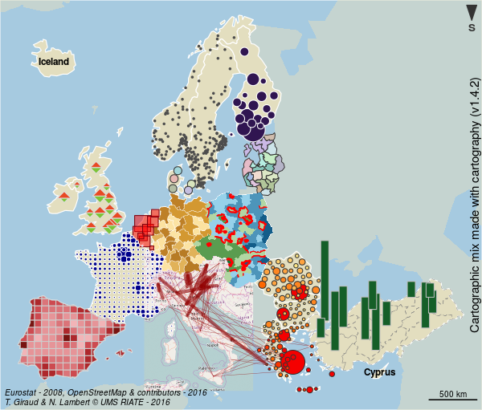

# [Cartographie avec R : le package `cartography`](https://rcarto.github.io/semin-r_2017/)

Cette présentation est accessible [ici](https://rcarto.github.io/semin-r_2017/).

**[SEMIN-R](http://rug.mnhn.fr/semin-r/)**   
Museum National d'Histoire Naturelle |  *Vendredi 16 juin 2017*   

Timothée Giraud  
[UMS RIATE](http://riate.cnrs.fr)  
[http://rgeomatic.hypotheses.org/](http://rgeomatic.hypotheses.org/)  

