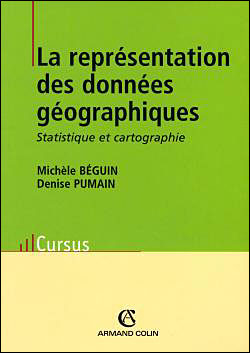

```{r knitr_init, echo=FALSE, cache=FALSE}
library(knitr)
library(rmdformats)

## Global options
options(max.print = "75")
opts_chunk$set(echo = TRUE,
	             cache = FALSE,
               prompt = FALSE,
               tidy = FALSE,
               comment = NA,
               message = FALSE,
               warning = FALSE)
opts_knit$set(width = 75)

knit_hooks$set(par = function(before, options, envir){
  if (before){
    par(mar=c(0,0,0,0))
  } 
})

knit_hooks$set(par.title = function(before, options, envir){
  if (before){
    par(mar=c(0,0,1.2,0))
  } 
})
```


# 
## Cartographie avec R, le package `cartography`


**[SEMIN-R](http://rug.mnhn.fr/semin-r/)**   
Museum National d'Histoire Naturelle |  *Vendredi 16 juin 2017*   

Timothée Giraud  
[UMS RIATE](http://riate.cnrs.fr)  
[http://rgeomatic.hypotheses.org/](http://rgeomatic.hypotheses.org/)  


# Les fonctionnalités spatiales de R

## Les indispensables {.tabset .tabset-fade .tabset-pills}

3 packages sont incontournables

### rgdal

**Import/export d'objets spatiaux et gestion des projections cartographiques**   

`rgdal` est une interface entre R et les librairies GDAL ([Geospatial Data Abstraction Library](http://www.gdal.org/)) et [PROJ4](https://github.com/OSGeo/proj.4).


```{r ImportShp, cache = T}
library("rgdal")
nuts3 <- readOGR(dsn = "data", layer = "nuts3", verbose = TRUE)
```


### sp

**Manipulation et affichage d'objets spatiaux** 

`sp` fournit des classes et des methodes pour les données spatiales dans R.

```{r InspectSPDF, par = TRUE, cache = T}
library("sp")
head(nuts3@data)
plot(nuts3)
plot(nuts3, col = "#DAE3E6", border = "#8A0641", lwd = 0.5)
```


### rgeos
**Géotraitements**

`rgeos` donne accès à la librairie d'opérations spatiales GEOS ([Geometry Engine - Open Source](http://trac.osgeo.org/geos/)) qui permet notamment d'effectuer les géotraitements suivants :  

* Area / Perimeter 
* Distances  
* **Dissolve**
* **Buffer**
* Overlap / intersect / difference
* Contains / within
* Union
* ...

#### Agrégation des polygones / dissolve

```{r predissolve, echo = FALSE, cache = TRUE }
library("rgeos")
nuts3 <- gBuffer(nuts3, byid = T, width = 1)
```

```{r dissolve, par = TRUE, cache = TRUE }
library("rgeos")
europe <- gUnaryUnion(spgeom = nuts3)
plot(nuts3, lwd = 0.5)
plot(europe, lwd = 2, border = "red", add=T)
```

#### Création de zones tampons / buffer
```{r buff er, par = TRUE, cache = TRUE}
library("rgeos")
europeBuffer <- gBuffer(spgeom = europe, width = 50000)
plot(europe, col = "#92C5D6")
plot(europeBuffer, add = T, border = "red")

```

## Le futur : le package sf


# Le package cartography

## Installation 

- Version stable

- Version de développement

- Version avec sf


## Les données


## Démonstration


# Ressources {.tabset .tabset-fade .tabset-pills}


Cette présentation est disponible ici


## *Package* `cartography`

**La page GitHub du *package* `cartography`**

C'est dans [ce dépôt GitHub](https://github.com/Groupe-ElementR/cartography) que se déroule le développement du *package* et que se tiennent les [discussions](https://github.com/Groupe-ElementR/cartography/issues) à son sujet.


**Billets de blogs, tutoriels, présentations**

[Demo codes in the R graph Gallery](http://www.r-graph-gallery.com/portfolio/maps/) (EN)  
[Create and integrate maps in your R workflow with the cartography package](http://rgeomatic.hypotheses.org/842) (EN)  
[De superbes cartes thématiques...](http://rgeomatic.hypotheses.org/1086)(FR)  
[Le package cartography a un an](http://rgeomatic.hypotheses.org/1016)(FR)    
[Cartographie avec R : le package cartography](http://rgeomatic.hypotheses.org/659) (FR)  
[R pour les cartographes](http://neocarto.hypotheses.org/1859) (FR)    
[Comment faire un carton avec R?](http://rgeomatic.hypotheses.org/category/cartography) (FR - *How to build inset maps*)  
[Tutoriel - Cartographie avec R](http://wukan.ums-riate.fr/r2016/) (FR)  
[Cartographie et traitement de l’information géographique avec R](http://wukan.ums-riate.fr/RUSS/RUSS_2016/) (FR)  
[R pour les cartographes : le package cartography](https://osgeo-fr.github.io/presentations_foss4gfr/2016/J1/R_Cartography_T_Giraud_FOSS4G-fr-2016/FOSS4G-fr-2016.html) (FR)

Le blog [http://rgeomatic.hypotheses.org/](http://rgeomatic.hypotheses.org/)


## *Package* `sf`


**La page GitHub du *package* `sf`**

C'est dans [ce dépôt GitHub](https://github.com/edzer/sfr) que se déroule le développement du *package* et que se tiennent les [discussions](https://github.com/edzer/sfr/issues?utf8=%E2%9C%93&q=is%3Aissue%20) à son sujet.

**Les ressources publiées par Edzer Pebesma**


Le créateur et *maintainer* de `sf` a publié un certain de nombre de vignettes et de billets autour du package.

* Vignettes

    -   [Simple Features for R](https://cran.r-project.org/web/packages/sf/vignettes/sf1.html) Explication très détaillée des principes et du fonctionnement du package.
    -   [Reading, Writing and Converting Simple Features](https://cran.r-project.org/web/packages/sf/vignettes/sf2.html)
        Comment importer et exporter des objets.
    -   [Manipulating Simple Feature Geometries](https://cran.r-project.org/web/packages/sf/vignettes/sf3.html)
        Comment manipuler les objets `sf`, géotraitements, projections...  

* Billets de blog

    -   [Simple features for R](http://r-spatial.org/r/2016/02/15/simple-features-for-r.html)
    -   [Simple features for R, part 2](http://r-spatial.org/r/2016/07/18/sf2.html)
    -   [Simple features now on CRAN](http://r-spatial.org/r/2016/11/02/sfcran.html)
    -   [sf - plot, graticule, transform, units, cast, is](http://r-spatial.org/r/2017/01/12/newssf.html)


* Migration de `sp` ver `sf`
    
    [Un tableau de migration de `sp` vers `sf`](https://github.com/edzer/sfr/wiki/migrating) pour passer de l'utilisation des packages `sp`, `rgeos` et `rgdal` à l'utilisation de `sf`.


**Billets de blogs / tutoriels**

-   [Faire des cartes avec R - Introduction au package sf](https://github.com/riatelab/intro_sf) - Santiago Mora

-   [Tidy spatial data in R: using dplyr, tidyr, and ggplot2 with sf](http://strimas.com/r/tidy-sf/) - Matt Strimas-Mackey

-   [First Impressions From sf – The Simple Features R Package](https://geographicdatascience.com/2017/01/06/first-impressions-from-sf-the-simple-features-r-package/) - Geographic Data Science Lab

-   [Spatial analysis pipelines with simple features in R](https://walkerke.github.io/2016/12/spatial-pipelines/) - Kyle Walker

-   [Spatial analysis in R with the sf package](http://rhodyrstats.org/geospatial_with_sf/geospatial_with_sf.html) - rhodyRstats

-   [Landscape Ecology with R:A tutorial with raster and sf](http://jwhollister.com/r_landscape_tutorial/tutorial.html) - Jeffrey W. Hollister

-   [Mapping “France at night” with the new sf package](http://sharpsightlabs.com/blog/mapping-france-night/) - Sharp Sight Labs

## La cartographie

  

- Michelle Béguin et Denise Pumain. "La représentation des données géographiques, Statistique et cartographie." (2003). Paris, Armand Colin, Coll. Cursus, 192p.


!  

- Nicolas Lambert et Christine Zanin. "Manuel de cartographie: principes, méthodes, applications." (2016). Paris, Armand Colin, Coll. Cursus, 224p.


